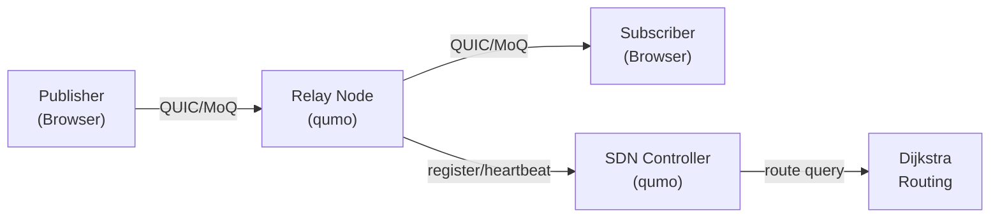

# qumo

[](https://github.com/okdaichi/qumo/actions/workflows/ci.yml)
[](https://goreportcard.com/report/github.com/okdaichi/qumo)
[](LICENSE)

**qumo** is a high-performance Media over QUIC (MoQ) relay server with intelligent topology management, enabling distributed media streaming over the QUIC transport protocol.

## Features

- 🚀 **High-Performance Relay**: Built on QUIC for low-latency media streaming
- 📡 **MoQT Protocol**: Full Media over QUIC Transport support
- 🧭 **SDN Controller**: Centralized topology and routing management
-  **Observability**: Prometheus metrics, health probes, and status APIs
- 🔒 **TLS Security**: Built-in TLS 1.3 support for encrypted connections
- 💾 **Persistent Topology**: Optional disk-based topology storage
- 🌐 **HA Support**: Peer synchronization for high-availability deployments

## Quick Start

### For External Users (Easiest)

Get started in 3 steps without cloning the repository:

```bash
# 1. Download config files
mkdir qumo && cd qumo
curl -O https://raw.githubusercontent.com/okdaichi/qumo/main/config.relay.yaml
curl -O https://raw.githubusercontent.com/okdaichi/qumo/main/config.sdn.yaml
curl -O https://raw.githubusercontent.com/okdaichi/qumo/main/docker-compose.external.yml

# 2. Generate TLS certificates
mkdir -p certs
mkcert -install
mkcert -cert-file certs/server.crt -key-file certs/server.key localhost 127.0.0.1 ::1

# 3. Start services
docker-compose -f docker-compose.external.yml up -d

# Verify
curl http://localhost:8090/graph  # SDN Controller
curl http://localhost:8080/health # Relay Server
```

### For Developers

See [Installation](#installation) and [Development](#development) sections below.

## Installation

#### Option 1: Install via Go

```bash
go install github.com/okdaichi/qumo@latest
```

#### Option 2: Download Binary (Recommended)

Download the latest binary from [GitHub Releases](https://github.com/okdaichi/qumo/releases):

```bash
# Linux/macOS
curl -L https://github.com/okdaichi/qumo/releases/latest/download/qumo-linux-amd64 -o qumo
chmod +x qumo
./qumo relay -config config.relay.yaml

# Windows
# Download qumo-windows-amd64.exe from releases page
```

#### Option 3: Docker (No Build Required)

```bash
# Pull pre-built image from GitHub Container Registry
docker pull ghcr.io/okdaichi/qumo:latest

# Or use Docker Hub
docker pull okdaichi/qumo:latest

# Run relay
docker run -d \
  --name qumo-relay \
  -p 4433:4433/udp \
  -p 8080:8080 \
  -v $(pwd)/certs:/app/certs:ro \
  ghcr.io/okdaichi/qumo:latest relay -config config.relay.yaml
```

#### Option 4: Build from Source

```bash
git clone https://github.com/okdaichi/qumo.git
cd qumo
go build -o qumo
```

### Generate TLS Certificates (Development)

For local testing, generate self-signed certificates:

```bash
openssl req -x509 -newkey rsa:4096 -keyout certs/server.key \
  -out certs/server.crt -days 365 -nodes \
  -subj "/CN=localhost" \
  -config certs/dev.cnf
```

### Run Relay Server

```bash
# Start relay server
./qumo relay -config config.relay.yaml
```

The relay server will start on:
- **QUIC/MoQT**: `0.0.0.0:4433` (UDP)
- **Health/Metrics**: `localhost:8080` (HTTP)

Verify it's running:

```bash
curl http://localhost:8080/health
```

## Docker Deployment

Run qumo in isolated containers for development and testing.

### Prerequisites

- Docker Engine 20.10+
- Docker Compose v2.0+ (optional, for multi-service setup)

### Using Pre-built Images (Recommended)

Pull and run the latest release without building:

```bash
# Option 1: Download external compose file
curl -O https://raw.githubusercontent.com/okdaichi/qumo/main/docker-compose.external.yml

# Generate certificates (if not already done)
mkdir -p certs
mkcert -install
mkcert -cert-file certs/server.crt -key-file certs/server.key localhost 127.0.0.1 ::1

# Download default config files
curl -O https://raw.githubusercontent.com/okdaichi/qumo/main/config.relay.yaml
curl -O https://raw.githubusercontent.com/okdaichi/qumo/main/config.sdn.yaml

# Start services
docker-compose -f docker-compose.external.yml up -d

# Option 2: Create docker-compose.yml inline
cat > docker-compose.yml <<EOF
version: '3.8'

services:
  sdn:
    image: ghcr.io/okdaichi/qumo:latest
    container_name: qumo-sdn
    command: ["sdn", "-config", "config.sdn.yaml"]
    ports:
      - "8090:8090"
    volumes:
      - ./config.sdn.yaml:/app/config.sdn.yaml:ro
      - ./data:/app/data
    restart: unless-stopped

  relay:
    image: ghcr.io/okdaichi/qumo:latest
    container_name: qumo-relay
    command: ["relay", "-config", "config.relay.yaml"]
    ports:
      - "4433:4433/udp"
      - "8080:8080"
    volumes:
      - ./config.relay.yaml:/app/config.relay.yaml:ro
      - ./certs:/app/certs:ro
    depends_on:
      - sdn
    restart: unless-stopped
EOF

# Start services
docker-compose up -d
```

### Development Setup (Build from Source)

For contributors or when modifying the code:

1. **Clone repository**:
   ```bash
   git clone https://github.com/okdaichi/qumo.git
   cd qumo
   ```

2. **Generate TLS certificates** (required for MoQT):
   ```bash
   # Install mkcert (first time only)
   # Windows: winget install FiloSottile.mkcert
   # macOS: brew install mkcert
   # Linux: See https://github.com/FiloSottile/mkcert#installation
   
   # Generate certificates
   mkdir -p certs
   mkcert -install
   mkcert -cert-file certs/server.crt -key-file certs/server.key \
     localhost 127.0.0.1 ::1
   ```

2. **Start all services**:
   ```bash
   docker-compose up -d
   ```

3. **Verify services**:
   ```bash
   # SDN Controller
   curl http://localhost:8090/graph
   
   # Relay Health Check
   curl http://localhost:8080/health
   ```

4. **View logs**:
   ```bash
   # All services
   docker-compose logs -f
   
   # Specific service
   docker-compose logs -f relay
   docker-compose logs -f sdn
   ```

5. **Stop services**:
   ```bash
   docker-compose down
   ```

### Run Containers Manually

#### Using Pre-built Images

**Run relay server**:
```bash
docker run -d \
  --name qumo-relay \
  -p 4433:4433/udp \
  -p 8080:8080 \
  -v $(pwd)/config.relay.yaml:/app/config.relay.yaml:ro \
  -v $(pwd)/certs:/app/certs:ro \
  ghcr.io/okdaichi/qumo:latest relay -config config.relay.yaml
```

**Run SDN controller**:
```bash
docker run -d \
  --name qumo-sdn \
  -p 8090:8090 \
  -v $(pwd)/config.sdn.yaml:/app/config.sdn.yaml:ro \
  -v $(pwd)/data:/app/data \
  ghcr.io/okdaichi/qumo:latest sdn -config config.sdn.yaml
```

#### Build and Run from Source

**Build image**:
```bash
docker build -t qumo:latest .
```

**Run relay server**:
```bash
docker run -d \
  --name qumo-relay \
  -p 4433:4433/udp \
  -p 8080:8080 \
  -v $(pwd)/config.relay.yaml:/app/config.relay.yaml:ro \
  -v $(pwd)/certs:/app/certs:ro \
  qumo:latest relay -config config.relay.yaml
```

**Run SDN controller**:
```bash
docker run -d \
  --name qumo-sdn \
  -p 8090:8090 \
  -v $(pwd)/config.sdn.yaml:/app/config.sdn.yaml:ro \
  -v $(pwd)/data:/app/data \
  qumo:latest sdn -config config.sdn.yaml
```

### Port Mapping

| Service | Port | Protocol | Description |
|---------|------|----------|-------------|
| Relay   | 4433 | UDP      | MoQT (QUIC) |
| Relay   | 8080 | TCP      | Health/Metrics |
| SDN     | 8090 | TCP      | HTTP API |

### Volume Mounts

- `./certs:/app/certs:ro` - TLS certificates (relay)
- `./data:/app/data` - Persistent topology data (SDN)

### Environment Customization

Override configuration via environment variables:

```bash
docker run -e RELAY_ADDRESS=":5000" qumo:latest relay -config config.relay.yaml
```

See [config.relay.yaml](config.relay.yaml) and [config.sdn.yaml](config.sdn.yaml) for available options.

## Integration with Your Project

### As a Microservice

Add qumo to your existing docker-compose.yml:

```yaml
services:
  # Your existing services...
  
  qumo-relay:
    image: ghcr.io/okdaichi/qumo:latest
    command: ["relay", "-config", "config.relay.yaml"]
    ports:
      - "4433:4433/udp"
      - "8080:8080"
    volumes:
      - ./qumo/config.relay.yaml:/app/config.relay.yaml:ro
      - ./qumo/certs:/app/certs:ro
    restart: unless-stopped
```

### As a Go Dependency

Use qumo packages in your Go application:

```go
import (
    "github.com/okdaichi/qumo/internal/relay"
    "github.com/okdaichi/qumo/internal/sdn"
)

// Use relay or SDN components directly
```

### As a Sidecar (Kubernetes)

```yaml
apiVersion: v1
kind: Pod
metadata:
  name: my-app
spec:
  containers:
  - name: app
    image: my-app:latest
  - name: qumo-relay
    image: ghcr.io/okdaichi/qumo:latest
    args: ["relay", "-config", "/config/config.relay.yaml"]
    ports:
    - containerPort: 4433
      protocol: UDP
    - containerPort: 8080
      protocol: TCP
    volumeMounts:
    - name: config
      mountPath: /config
    - name: certs
      mountPath: /app/certs
  volumes:
  - name: config
    configMap:
      name: qumo-config
  - name: certs
    secret:
      secretName: qumo-certs
```

## Usage

qumo provides two subcommands for different deployment scenarios.

### relay

Start a media relay server that forwards MoQT streams between publishers and subscribers.

**Start Server:**
```bash
qumo relay -config config.relay.yaml
```

**Configuration:**
Edit [config.relay.yaml](config.relay.yaml) with your settings.

**Default Ports:**
- `0.0.0.0:4433` - QUIC/MoQT (UDP)
- `:8080` - Health/Metrics (HTTP)

**Key Features:**
- Media track distribution
- Group caching for performance
- Prometheus metrics export
- Auto-announce to SDN controller (opt-in)

**API Endpoints:**
- `GET /health?probe={live|ready}` - Health probes
- `GET /metrics` - Prometheus metrics

**Examples:**
```bash
# Health check
curl http://localhost:8080/health

# Readiness probe
curl http://localhost:8080/health?probe=ready

# Metrics
curl http://localhost:8080/metrics
```

**Web Demo:**
Test with browser-based webcam/audio streaming client:
```bash
cd solid-deno
npm install && npm run dev
# Open http://localhost:5173
```
See [solid-deno/README.md](solid-deno/README.md) for details.

**Auto-Announce (optional):**

When `sdn.url` is set in `config.relay.yaml`, the relay automatically registers received announcements with the SDN controller's announce table. Other relays (or clients) can then query the SDN to discover which relay holds which track.

```yaml
sdn:
  url: "https://sdn.example.com:8090"
  relay_name: "relay-tokyo-1"
  heartbeat_interval_sec: 30
  # tls:
  #   cert_file: "certs/relay.crt"
  #   key_file: "certs/relay.key"
  #   ca_file: "certs/ca.crt"
```

Entries expire after 90 seconds on the SDN side; the relay heartbeat (default 30s) keeps them alive.

### sdn

Start an SDN controller that manages topology and routing across multiple relay nodes.

**Start Controller:**
```bash
qumo sdn -config config.sdn.yaml
```

**Configuration:**
Edit [config.sdn.yaml](config.sdn.yaml) with your settings.

**Default Port:**
- `:8090` - HTTP API

**Key Features:**
- Dynamic relay registration
- Dijkstra-based routing
- Track announcement directory
- Optional persistent storage
- HA peer synchronization

**API Endpoints:**
- `PUT /node/<name>` - Register relay
- `DELETE /node/<name>` - Deregister relay
- `GET /route?from=X&to=Y` - Compute optimal route
- `GET /graph` - Get topology
- `GET /graph/matrix` - Get adjacency matrix
- `PUT /announce/<track>` - Announce track
- `GET /announce/lookup?track=X` - Find relays for track
- `GET /sync` / `PUT /sync` - HA synchronization

**Examples:**
```bash
# Get topology
curl http://localhost:8090/graph

# Compute route
curl http://localhost:8090/route?from=relay-a&to=relay-b

# Find tracks
curl http://localhost:8090/announce/lookup?track=camera/video
```

## Architecture

### System Overview



## Development

**Requirements:** Go 1.21+, Node.js 18+ (for web demo)

```bash
# Run tests
go test ./...

# Coverage
go test -coverprofile=coverage.out ./...
go tool cover -html=coverage.out
```

## Deployment

### Docker (Coming Soon)

```bash
# Build image
docker build -t qumo .

# Run relay
docker run -p 4433:4433/udp -p 8080:8080 \
  -v $(pwd)/config.relay.yaml:/config.yaml \
  -v $(pwd)/certs:/certs \
  qumo relay -config /config.yaml
```

### Systemd Service

Create `/etc/systemd/system/qumo-relay.service`:

```ini
[Unit]
Description=qumo Media Relay Server
After=network.target

[Service]
Type=simple
User=qumo
ExecStart=/usr/local/bin/qumo relay -config /etc/qumo/config.relay.yaml
Restart=on-failure
RestartSec=5

[Install]
WantedBy=multi-user.target
```

Enable and start:

```bash
sudo systemctl daemon-reload
sudo systemctl enable qumo-relay
sudo systemctl start qumo-relay
```

### Kubernetes

See [deploy/README.md](deploy/README.md) for Kubernetes deployment manifests.

## Troubleshooting

- **TLS errors**: Regenerate certificates (see Quick Start)
- **Port in use**: Check with `lsof -i :4433` or `netstat -ano`

```