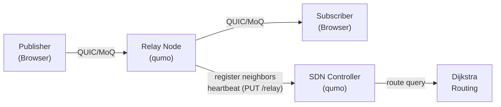

# qumo

[](https://github.com/okdaichi/qumo/actions/workflows/ci.yml)
[](https://goreportcard.com/report/github.com/okdaichi/qumo)
[](LICENSE)

**qumo** is a high-performance Media over QUIC (MoQ) relay server with intelligent topology management, enabling distributed media streaming over the QUIC transport protocol.

## Features

- 🚀 **High-Performance Relay**: Built on QUIC for low-latency media streaming
- 📡 **MoQT Protocol**: Full Media over QUIC Transport support
- 🧭 **SDN Controller**: Centralized topology and routing management
- 🔄 **Self-Organizing Topology**: Relays self-register via heartbeat; stale nodes auto-expire (Node TTL)
- 📊 **Observability**: Prometheus metrics, health probes, and status APIs
- 🔒 **TLS Security**: Built-in TLS 1.3 support for encrypted connections
- 💾 **Persistent Topology**: Optional disk-based topology storage
- 🌐 **HA Support**: Peer synchronization for high-availability deployments
- 🐳 **Docker-First**: PostgreSQL-style zero-config with env vars; multi-arch images

## Quick Start

### Demo Environment (Try it Now!)

Experience a complete MoQT network with 1 SDN controller and 3 relay servers:

```bash
# Start demo environment
docker compose -f docker-compose.simple.yml up

# Each relay self-registers its topology via heartbeat — no setup service needed.
# After ~30 seconds, the SDN graph builds itself:

# View network topology
curl http://localhost:8090/graph | jq

# Find optimal route from Tokyo to New York
curl "http://localhost:8090/route?from=relay-tokyo&to=relay-newyork"

# Check version
docker exec qumo-relay-tokyo /app/qumo version

# Stop demo
docker compose -f docker-compose.simple.yml down
```

**Network Topology (auto-configured):**
```
relay-tokyo (Asia) <--250ms--> relay-london (Europe) <--80ms--> relay-newyork (Americas)
```

**Access Points:**
- SDN Controller: http://localhost:8090
- Relay Tokyo: https://localhost:4433 (health: http://localhost:8080)
- Relay London: https://localhost:4434 (health: http://localhost:8081)
- Relay New York: https://localhost:4435 (health: http://localhost:8082)

**No shell scripts or manual setup required!** Relays self-register their neighbors via topology heartbeat. Everything runs in Docker and works the same on Windows, macOS, and Linux.

### For External Users (Easiest)

Get started in 3 steps without cloning the repository:

**Option 1: Super Simple (PostgreSQL-style)**

Just add to your docker-compose.yml - no config files or certificates needed:

```yaml
services:
  qumo-relay:
    image: ghcr.io/okdaichi/qumo:latest
    ports:
      - "4433:4433/udp"
      - "8080:8080"
    environment:
      - INSECURE=true  # Auto-generates self-signed certs

  # Or use the provided simple compose file:
  # docker compose -f docker-compose.simple.yml up -d
```

That's it! Visit:
- Relay health: http://localhost:8080/health
- Relay metrics: http://localhost:8080/metrics

**Option 2: Full Setup (with real certificates)**

```bash
# 1. Download config files
mkdir qumo && cd qumo
curl -O https://raw.githubusercontent.com/okdaichi/qumo/main/config.relay.yaml
curl -O https://raw.githubusercontent.com/okdaichi/qumo/main/config.sdn.yaml
curl -O https://raw.githubusercontent.com/okdaichi/qumo/main/docker-compose.external.yml

# 2. Generate TLS certificates
mkdir -p certs
mkcert -install
mkcert -cert-file certs/server.crt -key-file certs/server.key localhost 127.0.0.1 ::1

# 3. Start services
docker compose -f docker-compose.external.yml up -d

# Verify
curl http://localhost:8090/graph  # SDN Controller
curl http://localhost:8080/health # Relay Server
```

### For Developers

See [Installation](#installation) and [Development](#development) sections below.

## Installation

#### Option 1: Install via Go

```bash
go install github.com/okdaichi/qumo@latest
```

#### Option 2: Download Binary (Recommended)

Download the latest binary from [GitHub Releases](https://github.com/okdaichi/qumo/releases):

```bash
# Linux/macOS
curl -L https://github.com/okdaichi/qumo/releases/latest/download/qumo-linux-amd64 -o qumo
chmod +x qumo
./qumo relay -config config.relay.yaml

# Windows
# Download qumo-windows-amd64.exe from releases page
```

#### Option 3: Docker (No Build Required)

```bash
# Pull pre-built image from GitHub Container Registry
docker pull ghcr.io/okdaichi/qumo:latest

# Or use Docker Hub
docker pull okdaichi/qumo:latest

# Run relay
docker run -d \
  --name qumo-relay \
  -p 4433:4433/udp \
  -p 8080:8080 \
  -v $(pwd)/certs:/app/certs:ro \
  ghcr.io/okdaichi/qumo:latest relay -config config.relay.yaml
```

#### Option 4: Build from Source

```bash
git clone https://github.com/okdaichi/qumo.git
cd qumo
mage build        # builds bin/qumo with version info
# or: go build -o qumo .
```

## Usage

qumo provides two subcommands for different deployment scenarios.

### version

Print build-time version information.

```bash
qumo version
# qumo v0.3.0
#   commit: f5a09bf
#   built:  2026-02-14T02:08:26Z
#   go:     go1.26.0

# Also works with:
qumo --version
qumo -v
```

### relay

Start a media relay server that forwards MoQT streams between publishers and subscribers.

**Start Server:**
```bash
qumo relay -config config.relay.yaml
```

**Configuration:**
Edit [config.relay.yaml](config.relay.yaml) with your settings.

**Default Ports:**
- `0.0.0.0:4433` - QUIC/MoQT (UDP)
- `:8080` - Health/Metrics (HTTP)

**Key Features:**
- Media track distribution
- Group caching for performance
- Prometheus metrics export
- Auto-announce to SDN controller (opt-in)

**API Endpoints:**
- `GET /health?probe={live|ready}` - Health probes
- `GET /metrics` - Prometheus metrics

**Examples:**
```bash
# Health check
curl http://localhost:8080/health

# Readiness probe
curl http://localhost:8080/health?probe=ready

# Metrics
curl http://localhost:8080/metrics
```

**Web Demo:**
Test with browser-based webcam/audio streaming client:
```bash
cd solid-deno
npm install && npm run dev
# Open http://localhost:5173
```
See [solid-deno/README.md](solid-deno/README.md) for details.

**Auto-Announce & Topology Registration (optional):**

When `sdn.url` is set in `config.relay.yaml`, the relay automatically registers received announcements with the SDN controller's announce table. Other relays (or clients) can then query the SDN to discover which relay holds which track.

If `neighbors` is configured, the relay also self-registers its topology via `PUT /relay/<name>` heartbeat, so the SDN builds the network graph automatically.

```yaml
sdn:
  url: "https://sdn.example.com:8090"
  relay_name: "relay-tokyo-1"
  heartbeat_interval_sec: 30
  address: "https://relay-tokyo-1:4433"   # MoQT endpoint for next-hop routing
  region: "asia"                           # region tag
  neighbors:                               # neighbor relays and edge costs
    relay-london-1: 250
    relay-newyork-1: 180
  # tls:
  #   cert_file: "certs/relay.crt"
  #   key_file: "certs/relay.key"
  #   ca_file: "certs/ca.crt"
```

Entries expire after `node_ttl_sec` on the SDN side (default 90s); the relay heartbeat (default 30s) keeps them alive.

### sdn

Start an SDN controller that manages topology and routing across multiple relay nodes.

**Start Controller:**
```bash
qumo sdn -config config.sdn.yaml
```

**Configuration:**
Edit [config.sdn.yaml](config.sdn.yaml) with your settings.

**Default Port:**
- `:8090` - HTTP API

**Key Features:**
- Dynamic relay registration with automatic topology discovery
- Node TTL & sweeper: relays that stop heartbeating are auto-removed
- Dijkstra-based routing
- Track announcement directory
- Optional persistent storage
- HA peer synchronization

**API Endpoints:**
- `PUT /relay/<name>` - Register/heartbeat relay (with neighbors, region, address)
- `DELETE /relay/<name>` - Deregister relay
- `GET /route?from=X&to=Y` - Compute optimal route
- `GET /graph` - Get topology
- `PUT /announce/<track>` - Announce track
- `GET /announce/lookup?track=X` - Find relays for track
- `GET /sync` / `PUT /sync` - HA synchronization

**Examples:**
```bash
# Get topology
curl http://localhost:8090/graph

# Compute route
curl http://localhost:8090/route?from=relay-a&to=relay-b

# Find tracks
curl http://localhost:8090/announce/lookup?track=camera/video
```

## Configuration

### Environment Variables

Override configuration via environment variables (Docker only):

**Relay Server:**
- `INSECURE=true` - Auto-generate self-signed certificates (development only)
- `RELAY_ADDR` - Bind address (default: `0.0.0.0:4433`)
- `CERT_FILE` / `KEY_FILE` - TLS certificate paths
- `GROUP_CACHE_SIZE` - Group cache size (default: `100`)
- `FRAME_CAPACITY` - Frame buffer size (default: `1500`)
- `SDN_URL` - SDN controller URL (optional)
- `RELAY_NAME` - Relay identifier (optional)
- `HEARTBEAT_INTERVAL` - Heartbeat interval in seconds (default: `30`)
- `NEIGHBORS` - Comma-separated neighbor list, e.g. `relay-london:250,relay-newyork:80`
- `REGION` - Region tag, e.g. `asia`
- `RELAY_MOQT_ADDR` - MoQT endpoint for next-hop routing (default: `https://<RELAY_NAME>:4433`)

**SDN Controller:**
- `SDN_ADDR` - Bind address (default: `:8090`)
- `DATA_DIR` - Data directory (default: `./data`)
- `PEER_URL` - HA peer URL (optional)
- `SYNC_INTERVAL` - Sync interval in seconds (default: `10`)
- `NODE_TTL_SEC` - Node TTL in seconds; `0` = never expire (default: `90`)

See [config.relay.yaml](config.relay.yaml) and [config.sdn.yaml](config.sdn.yaml) for all YAML options.

### Ports

| Service | Port | Protocol | Description |
|---------|------|----------|-------------|
| Relay   | 4433 | UDP      | MoQT (QUIC) |
| Relay   | 8080 | TCP      | Health/Metrics |
| SDN     | 8090 | TCP      | HTTP API |

## Architecture

### System Overview



### Topology Lifecycle

1. **Registration** — Each relay sends `PUT /relay/<name>` with `{region, address, neighbors}` on startup
2. **Heartbeat** — The same PUT is repeated every `heartbeat_interval_sec` (default 30s)
3. **Routing** — SDN runs Dijkstra on the adjacency-list graph; returns full path, relay uses only next-hop (hop-by-hop forwarding)
4. **Expiry** — If a relay stops heartbeating, the SDN sweeper removes it after `node_ttl_sec` (default 90s)

## Development

**Requirements:** Go 1.26+, Node.js 18+ (for web demo)

### Build System (Mage)

qumo uses [Mage](https://magefile.org/) for build automation. All tasks embed version info via `-ldflags`.

```bash
# Install mage (first time)
go install github.com/magefile/mage@latest

# Show all available targets
mage help

# Build & Install
mage build         # Build binary to bin/qumo (with version ldflags)
mage install       # Install to $GOPATH/bin

# Test & Lint
mage test          # Run all tests
mage testVerbose   # Run tests with verbose output
mage check         # Run fmt + vet + test

# Docker
mage docker:build  # Build Docker image with version tags
mage docker:up     # Start services with docker compose
mage docker:down   # Stop services
mage docker:logs   # View service logs

# Demo (3-relay + SDN)
mage demo:up       # Start demo environment
mage demo:down     # Stop demo environment
mage demo:status   # Check demo status

# Runtime
mage relay         # Start relay server
mage sdn           # Start SDN controller
mage dev           # Start relay + SDN in dev mode
```

### Building with Version Info

Version metadata is injected at build time via `-ldflags`:

```bash
# Automatic (via Mage)
mage build
./bin/qumo version

# Manual
go build -ldflags "-s -w \
  -X github.com/okdaichi/qumo/internal/version.version=$(git describe --tags --always) \
  -X github.com/okdaichi/qumo/internal/version.commit=$(git rev-parse --short HEAD) \
  -X github.com/okdaichi/qumo/internal/version.date=$(date -u +%Y-%m-%dT%H:%M:%SZ)" \
  -o qumo .
```

### Tests

```bash
# Run tests
go test ./...

# Coverage
go test -coverprofile=coverage.out ./...
go tool cover -html=coverage.out
```

## Deployment

### Systemd Service

Create `/etc/systemd/system/qumo-relay.service`:

```ini
[Unit]
Description=qumo Media Relay Server
After=network.target

[Service]
Type=simple
User=qumo
ExecStart=/usr/local/bin/qumo relay -config /etc/qumo/config.relay.yaml
Restart=on-failure
RestartSec=5

[Install]
WantedBy=multi-user.target
```

Enable and start:

```bash
sudo systemctl daemon-reload
sudo systemctl enable qumo-relay
sudo systemctl start qumo-relay
```

### Kubernetes

See [deploy/README.md](deploy/README.md) for Kubernetes deployment manifests.

## Troubleshooting

- **TLS errors**: Regenerate certificates (see Quick Start)
- **Port in use**: Check with `lsof -i :4433` or `netstat -ano`