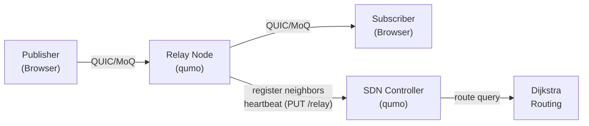
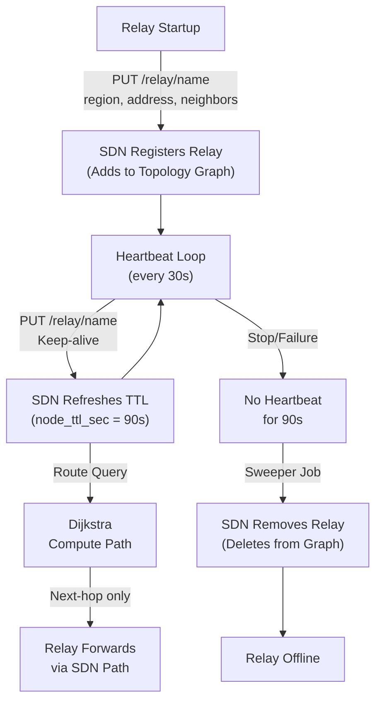

# qumo

[](https://github.com/okdaichi/qumo/actions/workflows/ci.yml)
[](https://goreportcard.com/report/github.com/okdaichi/qumo)
[](LICENSE)

**qumo** is a high-performance Media over QUIC (MoQ) relay server with intelligent topology management, enabling distributed media streaming over the QUIC transport protocol.

## Features

- 🚀 **High-Performance Relay**: Built on QUIC for low-latency media streaming
- 📡 **MoQT Protocol**: Full Media over QUIC Transport support
- 🧭 **SDN Controller**: Centralized topology and routing management
- 🔄 **Self-Organizing Topology**: Relays self-register via heartbeat; stale nodes auto-expire (Node TTL)
- 📊 **Observability**: Prometheus metrics, health probes, and status APIs
- 🔒 **TLS Security**: Built-in TLS 1.3 support for encrypted connections
- 💾 **Persistent Topology**: Optional disk-based topology storage
- 🌐 **HA Support**: Peer synchronization for high-availability deployments
- 🐳 **Docker-Support**: Env-var zero-config; prebuilt multi-arch images on GHCR (ghcr.io/okdaichi/qumo)

## Quick Start

### Demo Environment (short)

A complete Docker-based demo (SDN + 3 relays) and all Docker-related examples have been consolidated under `docker/`. See `docker/README.md` for quick start, compose files, and GHCR usage.

### For Developers

See [Installation](#installation) and [Development](#development) sections below.

## Installation

#### Option 1: Install via Go

```bash
go install github.com/okdaichi/qumo@latest
```

#### Option 2: Download Binary (Recommended)

Download the latest binary from [GitHub Releases](https://github.com/okdaichi/qumo/releases):

```bash
# Linux/macOS
curl -L https://github.com/okdaichi/qumo/releases/latest/download/qumo-linux-amd64 -o qumo
chmod +x qumo
./qumo relay -config config.relay.yaml

# Windows
# Download qumo-windows-amd64.exe from releases page
```

#### Option 3: Docker (No Build Required)

See `docker/README.md` for comprehensive Docker usage, compose examples, and deployment options. Quick example:

```bash
# Pull pre-built image from GitHub Container Registry
docker pull ghcr.io/okdaichi/qumo:latest

# Run relay
docker run -d \
  --name qumo-relay \
  -p 4433:4433/udp \
  -p 8080:4433 \
  -v $(pwd)/certs:/app/certs:ro \
  ghcr.io/okdaichi/qumo:latest relay -config config.relay.yaml
```

#### Option 4: Build from Source

```bash
git clone https://github.com/okdaichi/qumo.git
cd qumo
mage build        # builds bin/qumo with version info
# or: go build -o qumo .
```

## Usage

qumo provides some subcommands for different deployment scenarios.

### version

Print build-time version information.

```bash
qumo version
# qumo v0.3.0
#   commit: f5a09bf
#   built:  2026-02-14T02:08:26Z
#   go:     go1.26.0

# Also works with:
qumo --version
qumo -v
```

### relay

Start a media relay server that forwards MoQ streams between publishers and subscribers.

**Start Server:**
```bash
qumo relay -config config.relay.yaml
```

**Configuration:**
Edit [config.relay.yaml](config.relay.yaml) with your settings.

**Key Features:**
- Fan-out media track forwarding
- Prometheus metrics export // WIP
- Auto-announce to SDN controller (opt-in)

**API Endpoints:**
- `GET /health` - Health probes
  - `GET /health?probe=ready` - Readiness probe
  - `GET /health?probe=live` - Liveness probe
- `GET /metrics` - Prometheus metrics

### sdn

Start an SDN controller that manages topology and routing across multiple relay nodes.

**Start Controller:**
```bash
qumo sdn -config config.sdn.yaml
```

**Configuration:**
Edit [config.sdn.yaml](config.sdn.yaml) with your settings.

**Key Features:**
- Dynamic relay registration with automatic topology discovery
- Node TTL & sweeper: relays that stop heartbeating are auto-removed
- Dijkstra-based routing
- Track announcement directory
- Optional persistent storage
- HA peer synchronization

**API Endpoints:**
- `PUT /relay/<name>` - Register/heartbeat relay (with neighbors, region, address)
- `DELETE /relay/<name>` - Deregister relay
- `GET /route?from=X&to=Y` - Compute optimal route
- `GET /graph` - Get topology
- `PUT /announce/<track>` - Announce track
- `GET /announce/lookup?track=X` - Find relays for track
- `GET /sync` / `PUT /sync` - HA synchronization

See [config.relay.yaml](config.relay.yaml) and [config.sdn.yaml](config.sdn.yaml) for all configuration options. For Docker-based environment variables and setup, see [docker/README.md](docker/README.md).

## Architecture

### System Overview



### Topology Lifecycle



## Development

**Requirements:** Go 1.26+, Node.js 18+ (for web demo)

### Project Structure

```
qumo/
├── docker/                     # Docker artifacts & docs
│   ├── Dockerfile              # Multi-stage container build
│   ├── docker-entrypoint.sh    # Auto-config from env vars
│   ├── docker-compose.yml      # Local build + dev
│   ├── docker-compose.external.yml  # GHCR-based deployment
│   ├── docker-compose.simple.yml    # Demo (SDN + 3 relays)
│   └── README.md               # Docker usage guide
│
├── internal/                   # Core implementation
│   ├── cli/                    # CLI entrypoints & config loading
│   ├── relay/                  # Relay server (handlers, sessions, caching)
│   ├── sdn/                    # SDN controller & client (topology, announce table)
│   ├── rtmp/                   # RTMP utilities
│   ├── topology/               # Dijkstra routing & graph management
│   └── version/                # Version info
│
├── magefiles/                  # Build automation (Mage tasks)
│
├── deploy/                     # Observability stack
│   ├── otel-collector-config.yaml
│   ├── prometheus.yaml
│   └── grafana/
│
├── solid-deno/                 # Web demo client (SolidJS + WebTransport)
│
├── certs/                      # TLS certificate examples
├── configs/                    # Configuration templates
├── benchmarks/                 # Performance benchmarks
├── examples/                   # Usage examples
├── docs/                       # Additional documentation
│
├── config.relay.yaml           # Relay configuration template
├── config.sdn.yaml             # SDN configuration template
├── .github/workflows/          # CI/CD pipelines
├── go.mod & go.sum             # Go dependencies
└── main.go                     # Entry point
```

### Build System (Mage)

qumo uses [Mage](https://magefile.org/) for build automation. All tasks embed version info via `-ldflags`.

```bash
# Install mage (first time)
go install github.com/magefile/mage@latest

# Show all available targets
mage help

# Build & Install
mage build         # Build binary to bin/qumo (with version ldflags)
mage install       # Install to $GOPATH/bin

# Test & Lint
mage test          # Run all tests
mage testVerbose   # Run tests with verbose output
mage check         # Run fmt + vet + test

# Docker
mage docker:build  # Build Docker image with version tags
mage docker:up     # Start services with docker compose
mage docker:down   # Stop services
mage docker:logs   # View service logs

# Demo (3-relay + SDN)
mage demo:up       # Start demo environment
mage demo:down     # Stop demo environment
mage demo:status   # Check demo status

# Runtime
mage relay         # Start relay server
mage sdn           # Start SDN controller
mage dev           # Start relay + SDN in dev mode
```

### Building with Version Info

Version metadata is injected at build time via `-ldflags`:

```bash
# Automatic (via Mage)
mage build
./bin/qumo version

# Manual
go build -ldflags "-s -w \
  -X github.com/okdaichi/qumo/internal/version.version=$(git describe --tags --always) \
  -X github.com/okdaichi/qumo/internal/version.commit=$(git rev-parse --short HEAD) \
  -X github.com/okdaichi/qumo/internal/version.date=$(date -u +%Y-%m-%dT%H:%M:%SZ)" \
  -o qumo .
```

### Tests

```bash
# Run tests
go test ./...

# Coverage
go test -coverprofile=coverage.out ./...
go tool cover -html=coverage.out
```

## Deployment

For systemd and Kubernetes deployment examples see `deploy/README.md`.  
> ⚠️ These examples are provided as *experimental/informational* samples and have not been fully validated by the project maintainers — use at your own risk. PRs to improve them are welcome.

## Troubleshooting

- **TLS errors**: Regenerate certificates (see Quick Start)
- **Port in use**: Check with `lsof -i :4433` or `netstat -ano`